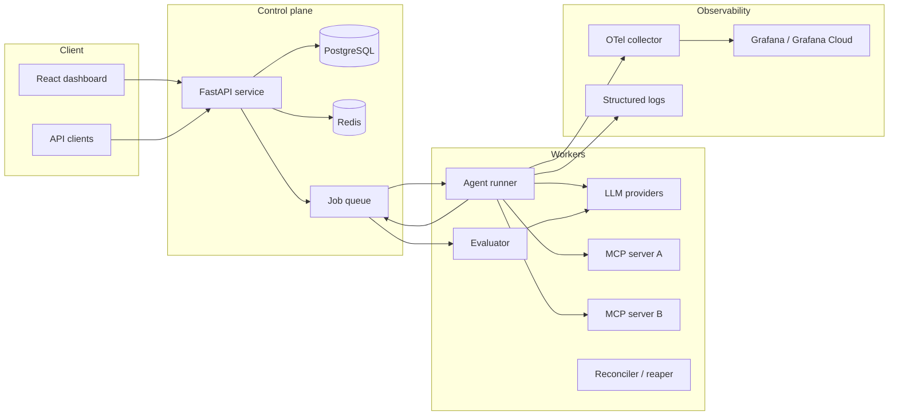

# AgentOps — Design Doc v0.1

> Multi-tenant platform to register AI agents that call tools (via MCP servers), run workflows, and get monitored/evaluated — with production-grade reliability engineering.
>
> Status: draft · Owner: (you) · Reviewers: interview story source M2–M5

## 1. Problem

Teams shipping LLM agents have no answer to: *did this run do the right thing, what did it cost, why did it fail, and can I reproduce it?* Agent tool-calling is non-deterministic, flaky (rate limits, timeouts, malformed outputs), and expensive. Existing observability tools show traces but don't close the loop with **evals, replay, and budgets**.

## 2. Goals / Non-goals

**Goals**
- Register agents + tools; run them as async jobs with retries, idempotency, and checkpoint/resume
- Score every run: correctness (LLM-as-judge + deterministic checks), latency, cost, failure taxonomy
- Full trace per run (every LLM + tool call = a span), replayable
- Multi-tenant: data isolation, per-tenant token budgets, tool allowlists, rate limits
- React dashboard: live run timeline, replay viewer, eval comparisons, cost analytics

**Non-goals (v1)**
- Training/fine-tuning; model hosting; streaming agent-to-agent protocols; multi-cloud

## 3. Architecture



## 4. Core design decisions (the interview bait)

### D1 — Idempotency on every run submission
- Client sends `Idempotency-Key` (UUID) with `POST /runs`
- No check-then-insert: the run INSERT itself is the claim. `UNIQUE (tenant_id, idempotency_key)` on `runs` arbitrates; the loser inspects `constraint_name` on the IntegrityError — its own key conflict → read + return the *original run* (200); the entity partial-index conflict → 409 busy
- Two independent layers: same *request* (key → 200 with original) vs same *entity* (one active run per ticket → 409). Terminal state releases the entity slot automatically (partial index predicate)
- `idempotency_keys` table (M2) stores response hash + 24h expiry for full-response replay
- **Trade-off:** exact-duplicate suppression vs. letting users intentionally re-run → re-runs get a *new* key; `parent_run_id` links them

### D2 — At-least-once delivery + checkpoint/replay (not exactly-once)
- Queue is at-least-once; workers must tolerate duplicates via the idempotency key + run-state machine (`queued → running → step_k → done | failed | cancelled`)
- **Checkpoint after every successful step:** writes (step output, token counts, artifacts) to Postgres in the same transaction as the state transition
- On crash/retry: resume from last successful step — LLM calls already paid for are not repeated
- **Trade-off:** exactly-once is a lie across network boundaries; we sell *effectively-once effects* via idempotent tool adapters where the tool supports it (dedupe token on write-tools)

### D3 — Multi-tenant rate limiting & budgets
- Redis token bucket per `(tenant, resource)` — atomic via Lua script (single RTT, no race)
- Two layers: request-level (runs/min) and spend-level (tokens/day); spend ledger updated post-run, checked pre-run
- **Trade-off:** Redis is the hot path → availability risk; fallback = fail *closed* for spend limits (avoid surprise bills), fail *open* for throughput limits (availability > fairness)

### D4 — Evals as first-class jobs
- Deterministic checks (JSON-schema validation, regex/extract assertions) run inline — cheap, blocking
- LLM-as-judge runs async after completion, on a sampled basis for high-volume tenants (cost control)
- Failure taxonomy enum: `tool_error | llm_refusal | schema_violation | budget_exceeded | timeout | hallucination_flagged`
- Dashboard aggregates: correctness %, p50/p95 latency, $/run by prompt/model variant → *the* eval-comparison story from the JD

### D5 — Observability
- OpenTelemetry: one trace per run; spans for each LLM call (model, tokens, cost) and tool call (name, latency, status)
- Trace_id propagates through the queue (context injection into job payload)
- Prometheus metrics: run duration, queue depth, retry rate, per-provider error rate

## 5. Data model (Postgres)

```
tenants(id, name, plan, created_at)
api_keys(id, tenant_id, key_hash, scopes, created_at, revoked_at)
agents(id, tenant_id, name, system_prompt, model, tool_allowlist jsonb, budget_limits jsonb)
tools(id, tenant_id, mcp_server_url, tool_name, input_schema jsonb, idempotent bool)
runs(id, tenant_id, agent_id, idempotency_key, parent_run_id, status, input jsonb,
     output jsonb, error jsonb, prompt_tokens, completion_tokens, cost_usd numeric,
     started_at, finished_at, trace_id)
  UNIQUE (tenant_id, idempotency_key)
steps(id, run_id, seq, type check (llm|tool|guardrail), name, input jsonb, output jsonb,
      status, tokens, cost_usd, latency_ms, created_at)          -- checkpoint unit
evals(id, run_id, judge_model, scores jsonb, deterministic_pass bool, failure_class, notes)
idempotency_keys(tenant_id, key, run_id, response_hash, created_at, expires_at)
```

Indexes: `runs(tenant_id, created_at desc)`, `runs(agent_id, status)`, `steps(run_id, seq)`. Partition `runs` by month when > ~50M rows (defensible estimate, not premature).

## 6. API sketch

```
POST /v1/runs                Idempotency-Key header; body: agent_id, input, budget override?
GET  /v1/runs/{id}           status + steps summary
POST /v1/runs/{id}/replay    forks from last successful step (new run, parent_run_id set)
POST /v1/runs/{id}/cancel
GET  /v1/runs/{id}/trace     spans (from OTel-enabled storage)
GET  /v1/evals?agent=&from=  aggregated scores for variant comparison
POST /v1/agents              register agent + allowlist
```

## 7. Failure modes we handle (each = a story)

| Failure | Handling |
|---|---|
| Duplicate run submission | D1 idempotency keys |
| Worker crash mid-run | D2 checkpoint/resume |
| Late/duplicated queue message | run-state machine rejects terminal-state transitions |
| LLM provider 429/timeout | exponential backoff + jitter, per-provider circuit breaker, failover to secondary model |
| Malformed LLM output | JSON-schema validation → auto-repair retry (n=1) → `schema_violation` failure class |
| Runaway agent (infinite tool loop) | max-steps, token budget guardrail enforced at step boundary |
| Redis down | D3 fail-open/fail-closed split |
| Poison message | DLQ + replay tooling with mutation |

## 8. Milestones

M1 scaffold + schema · M2 runner + queue + idempotency · M3 checkpoint/replay + evals + OTel · M4 dashboard + guardrails + rate limiting · M5 load test (k6), deploy, numbers, failure story.

## 9. Open questions

- [ ] Queue tech: Celery + Redis broker (fast to build) vs Kafka (stronger replay story, heavier ops) — **lean Celery for M2, document the Kafka migration path**
- [ ] Trace storage: Grafana Cloud free tier vs self-hosted Tempo
- [ ] Judge-model policy: fixed model vs tenant-selectable
